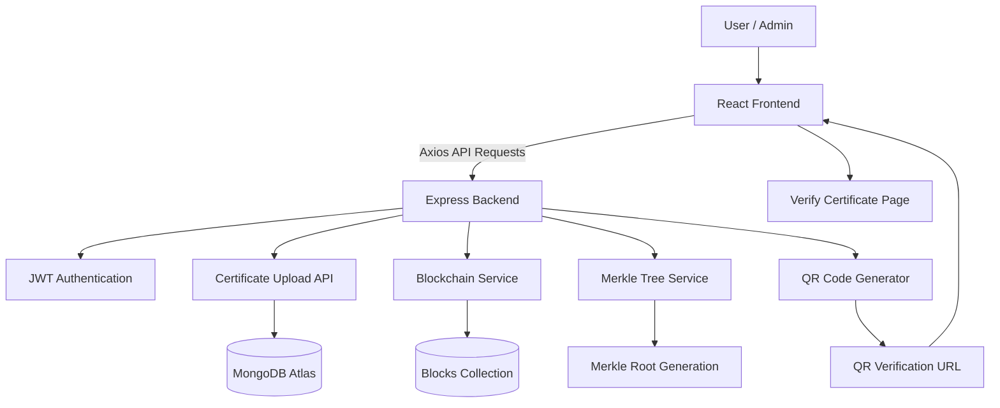

# 🚀 CertChain — Blockchain Certificate Verification System

## 📌 Overview

CertChain is a full-stack blockchain-inspired certificate verification platform built using the MERN stack.

It allows institutions or admins to:

- Upload certificates securely
- Generate tamper-proof hashes
- Store certificate integrity inside a blockchain-style structure
- Create Merkle roots for batch integrity validation
- Generate QR-based verification links
- Verify certificates publicly

The project demonstrates:

- Full-stack development
- JWT authentication
- File uploads
- Blockchain concepts
- Merkle Trees
- QR verification
- REST APIs
- Production deployment

---

# 🌍 Live Deployment

## Frontend
https://certchain-niladri-dev.vercel.app/

## Backend API
https://certchain-i5nw.onrender.com

---

# 🛠️ Tech Stack

## Frontend
- React
- Vite
- Tailwind CSS
- Axios
- React Router DOM

## Backend
- Node.js
- Express.js
- MongoDB
- Mongoose
- JWT Authentication
- Multer
- bcrypt

## Blockchain Features
- SHA-256 Hashing
- Blockchain-style linked blocks
- Merkle Tree generation
- QR Verification System

## Deployment
- Vercel (Frontend)
- Render (Backend)
- MongoDB Atlas (Database)

---

# ✨ Features

## 🔐 Authentication
- User Registration
- User Login
- JWT Protected Routes
- Token-based authorization

## 📄 Certificate Upload
- Upload certificates securely
- Generate unique SHA-256 hash
- Store certificate metadata

## ⛓️ Blockchain Integration
- Create linked blockchain blocks
- Store previous block hash
- Maintain chain integrity

## 🌳 Merkle Tree Validation
- Generate Merkle Root
- Validate certificate batch integrity

## 📱 QR Verification
- Generate QR code for every certificate
- Public verification endpoint

## 🧾 Blockchain Explorer
- View all blocks
- Track hash linkage
- Inspect Merkle roots

---

# 🧠 System Architecture



---

# 📁 Project Structure

```txt
certchain/
│
├── client/
│   ├── src/
│   │   ├── pages/
│   │   ├── components/
│   │   ├── api/
│   │   └── App.jsx
│
├── server/
│   ├── controllers/
│   ├── middleware/
│   ├── models/
│   ├── routes/
│   ├── services/
│   ├── config/
│   └── app.js
│
└── README.md
```

---

# ⚙️ Installation

## 1️⃣ Clone Repository

```bash
git clone https://github.com/CodingNIL/certchain.git
```

---

# 🚀 Backend Setup

## Navigate to server

```bash
cd server
```

## Install dependencies

```bash
npm install
```

## Create .env

```env
MONGO_URI=your_mongodb_uri
JWT_SECRET=your_secret
```

## Run backend

```bash
node app.js
```

---

# 🎨 Frontend Setup

## Navigate to client

```bash
cd client
```

## Install dependencies

```bash
npm install
```

## Start frontend

```bash
npm run dev
```

---

# 🔗 API Endpoints

## Authentication

### Register

```http
POST /api/auth/register
```

### Login

```http
POST /api/auth/login
```

---

## Certificates

### Upload Certificate

```http
POST /api/cert/upload
```

### Get Blockchain Blocks

```http
GET /api/cert/blocks
```

### Verify Certificate

```http
GET /api/cert/verify/:id
```

---

# 🔒 Security Features

- JWT Authentication
- Password hashing using bcrypt
- Protected upload routes
- Blockchain hash linkage
- Tamper detection

---

# 📈 Future Improvements

- IPFS Integration
- Smart Contracts
- Admin Dashboard
- Role-based access control
- Multi-file uploads
- Dockerization
- CI/CD Pipelines
- PDF certificate preview
- Analytics dashboard

---

# 👨‍💻 Author

Niladri Sarkar

Software Developer | MERN Stack | Backend Systems | Blockchain Applications

GitHub: https://github.com/CodingNIL

---

# ⭐ If you found this project interesting, consider giving it a star!
